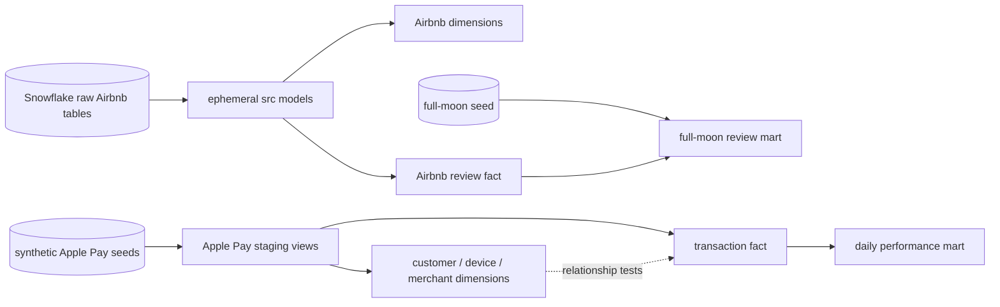

# Airbnb dbt + Apple Pay analytics learning lab

This project is a hands-on analytics engineering repository. It contains the
course's Snowflake/dbt Airbnb pipeline, a safe synthetic Apple Pay dimensional
model, and Node.js tools for practicing SQL locally or against relations that
dbt has built in Snowflake.

## What you will learn

- How raw data moves through sources, staging logic, dimensions, facts, and
  reporting marts.
- How dbt uses `source()`, `ref()`, materializations, tests, snapshots, hooks,
  macros, seeds, documentation, and exposures.
- How to declare the grain and relationships of a payment data model.
- How to query analytical tables with the Node.js installation already on this
  computer.
- How to make small, reviewable Git commits and verify them with CI.

## Architecture



The Airbnb branch needs preloaded Snowflake raw tables. The Apple Pay branch is
self-contained because it starts with synthetic CSV seeds. The local Node lab
also uses those seed files, so you can begin without warehouse credentials.

## Repository map

```text
airbnb/
|-- analyses/                 compiled, non-materialized investigation SQL
|-- assets/                   dbt Docs images
|-- docs/                     step-by-step learning guides
|-- macros/                   reusable Jinja and project behavior
|-- models/
|   |-- src/                  ephemeral Airbnb source cleanup
|   |-- dim/                  Airbnb dimensions
|   |-- fct/                  Airbnb facts
|   |-- mart/                 Airbnb reporting marts
|   `-- apple_pay/            staged Apple Pay dimensional model
|-- scripts/                  Node.js local and Snowflake query tools
|-- seeds/                    full-moon and synthetic Apple Pay CSV data
|-- snapshots/                Airbnb source history
|-- test/                     Node database, lesson, and UI API tests
|-- tests/                    dbt singular and custom generic tests
|-- ui/                       local SQL editor and interactive course
|-- _prod_profiles/           environment-variable Snowflake profile
|-- dbt_project.yml           dbt project configuration
|-- packages.yml              pinned dbt packages
`-- package.json              Node commands and Snowflake driver
```

## Start here: interactive SQL with Node.js

This workstation has Node.js 24 installed. The local lab uses Node's built-in
SQLite engine and the synthetic Apple Pay seeds, so it does not need Snowflake,
Python, dbt, or a password.

From this `airbnb` directory:

```powershell
node --version
npm install
npm run ui
```

Open <http://127.0.0.1:4173>. The browser lab provides a read-only SQL editor,
a model catalog, saved progress, and ten guided lessons that move from seeds to
staging, dimensions, facts, marts, and reconciliation. See
[`docs/INTERACTIVE_LEARNING_UI.md`](docs/INTERACTIVE_LEARNING_UI.md) for the
complete lesson plan and safety design.

The same local model is available from the terminal:

```powershell
npm run lab:tables
npm run lab:examples
npm run lab -- --example daily-performance
```

Run your own read-only query:

```powershell
npm run lab -- --sql "SELECT * FROM mart_apple_pay_daily_performance ORDER BY transaction_date, currency"
```

The lab intentionally permits only read-oriented SQL. See
[`docs/NODE_QUERY_LAB.md`](docs/NODE_QUERY_LAB.md) for table names, example
queries, flags, and the optional Snowflake mode.

## Build the dbt project in Snowflake

### Prerequisites

- A Snowflake account with the course's `AIRBNB.RAW` tables for the Airbnb
  branch.
- The `TRANSFORM` role, `COMPUTE_WH` warehouse, and expected grants described in
  the course setup.
- `uv`, which is installed on this computer.
- Python 3.10 through 3.13. The project intentionally excludes Python 3.14;
  `uv` will select a compatible interpreter.

From the repository root, install the pinned environment:

```powershell
uv sync
```

The checked-in `_prod_profiles/profiles.yml` reads these private environment
variables:

```text
SNOWFLAKE_ACCOUNT
DBT_USER
PRIVATE_KEY
PRIVATE_KEY_PASSPHRASE
DBT_ENV_NAME
```

Set them in your shell or secret manager. Never place their real values in Git.

Then run from this `airbnb` directory:

```powershell
uv run dbt debug --profiles-dir _prod_profiles --target dev
uv run dbt deps --profiles-dir _prod_profiles --target dev
uv run dbt source freshness --profiles-dir _prod_profiles --target dev
uv run dbt build --profiles-dir _prod_profiles --target dev
```

`dbt source freshness` is separate from `dbt build`. The static course review
data can trigger its one-hour warning even when the transformations are valid.

### Build only the Apple Pay learning model

The Apple Pay resources are tagged so they can be selected together:

```powershell
uv run dbt build --select tag:apple_pay --profiles-dir _prod_profiles --target dev --full-refresh
```

The first build creates all seed-backed relations. Later runs demonstrate the
transaction fact's incremental merge behavior.

## Query built Snowflake tables with Node.js

First build the dbt models. Then copy `.env.example` to `.env` and fill in your
own environment values. `.env` is ignored by Git.

```powershell
Copy-Item .env.example .env
npm run query:snowflake -- --list-models
npm run query:snowflake -- --model fct_apple_pay_transactions --limit 10
```

The Snowflake query tool is read-only by design and uses the official Node
driver. It does not replace dbt: dbt creates and tests the relations; Node reads
them for learning and analysis.

## Documentation

- [`docs/PIPELINE_WALKTHROUGH.md`](docs/PIPELINE_WALKTHROUGH.md) explains the
  existing Airbnb pipeline from raw ingestion through published relations.
- [`docs/APPLE_PAY_DATA_MODEL.md`](docs/APPLE_PAY_DATA_MODEL.md) teaches grain,
  relationships, transformations, tests, and safe payment-data handling.
- [`docs/IMPORTANT_FILE_TEMPLATES.md`](docs/IMPORTANT_FILE_TEMPLATES.md) provides
  copy-ready templates for the dbt files used most often.
- [`docs/NODE_QUERY_LAB.md`](docs/NODE_QUERY_LAB.md) teaches local and Snowflake
  querying with Node.js.
- [`docs/INTERACTIVE_LEARNING_UI.md`](docs/INTERACTIVE_LEARNING_UI.md) explains
  the browser SQL workspace and its ten result-checked lessons.

Generate dbt's lineage site after a successful build:

```powershell
uv run dbt docs generate --profiles-dir _prod_profiles --target dev
uv run dbt docs serve --profiles-dir _prod_profiles --target dev
```

## Everyday dbt commands

| Goal | Command |
|---|---|
| Check configuration | `uv run dbt debug --profiles-dir _prod_profiles --target dev` |
| Install dbt packages | `uv run dbt deps` |
| Build and test everything | `uv run dbt build` |
| Build a model and its parents | `uv run dbt build --select +dim_listings_w_hosts` |
| Build the Apple Pay branch | `uv run dbt build --select tag:apple_pay` |
| Update snapshots | `uv run dbt snapshot` |
| Compile an analysis | `uv run dbt compile --select full_moon_no_sleep` |
| Inspect generated lineage | `uv run dbt docs generate` |

Add `--profiles-dir _prod_profiles --target dev` to commands that access the
warehouse.

## Git workflow

Keep changes small and observable:

```powershell
git switch -c learning/<short-topic>
git status
git diff
git add <specific-files>
git commit -m "docs: explain <topic>"
git push -u origin learning/<short-topic>
```

Use the GitHub Actions result and the dbt build result as separate checks. CI
can parse the project and run the offline Node lab without Snowflake secrets;
an actual warehouse build still requires your Snowflake credentials and role.

## Security rules for payment data

This repository contains synthetic learning rows only. A real Apple Pay model
should receive merchant-approved, tokenized operational fields from a governed
source. Do not store or commit:

- primary account numbers (card numbers), CVVs, or expiration dates;
- Apple Pay cryptograms or reusable payment credentials;
- raw device tokens, private keys, passwords, or `.env` files;
- unnecessary customer names, addresses, email addresses, or phone numbers.

Use internal surrogate identifiers, least-privilege warehouse roles, encryption,
retention policies, access auditing, and your organization's PCI/privacy review.

## Troubleshooting

- **`dbt` is not recognized:** use `uv run dbt`, not a global `dbt` command.
- **Python 3.14 is selected:** run `uv sync`; the project pins a compatible
  Python range.
- **A `SRC_*` table is missing:** those Airbnb models are ephemeral CTEs, not
  physical relations.
- **`dbt deps` was skipped:** install the pinned packages before parsing or
  building models.
- **Node cannot connect to Snowflake:** confirm `.env`, the account identifier,
  private-key formatting, and that dbt has already created the relation.
- **The local Node lab works but Snowflake does not:** this is expected when
  warehouse credentials have not been configured; the two modes are separate.

## Course attribution

The Airbnb project originates from the *Complete dbt Bootcamp: Zero to Hero*
course materials. This fork adds personal learning documentation, the synthetic
Apple Pay model, local Node query tooling, and repository checks. Follow the
course license and do not present the upstream teaching materials as original
work.
