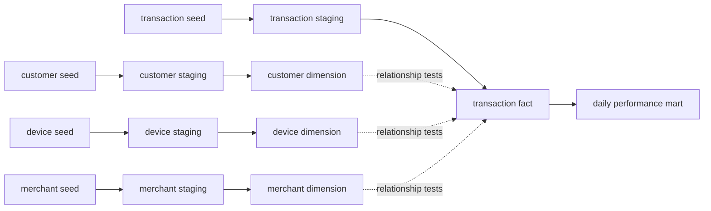

# Apple Pay Learning Data Model

This small project teaches dimensional modeling with a safe, synthetic Apple Pay-style
dataset. It follows the same pattern used in many analytics pipelines:

    CSV seeds -> staging views -> dimensions and fact -> daily mart -> learning queries

This is an educational merchant-analytics model, not an Apple production schema and not
a payment-processing implementation.

## Safety first

Every customer name, customer ID, merchant, device ID, and transaction in this example
is invented. The identifiers are internal learning keys only. They are not Apple IDs,
Apple credentials, device serial numbers, payment tokens, or identifiers supplied by
Apple.

In a production warehouse, a real customer name is personally identifiable information.
Keep it in a restricted PII layer with audited access, or omit it entirely when analysts
only need a pseudonymous customer key. Do not expose names in general-purpose marts.

The sample deliberately contains no:

- Primary account numbers (PANs) or card numbers
- CVVs or PINs
- Apple IDs, passwords, or authentication credentials
- Device account numbers, cryptograms, or real wallet tokens
- Real customer addresses or other sensitive personal data

A production payment model requires security, privacy, retention, access-control, and
regulatory reviews that are outside this learning exercise.

## Questions this model can answer

- How many payment attempts occurred each day?
- What is the approval rate for in-store, in-app, and web payments?
- Which merchant categories receive the most payment attempts?
- Which broad device types are used?
- Which synthetic decline reasons occur most often?
- How do approval rates differ by currency without mixing unlike monetary amounts?

## Pipeline map

Solid arrows are `ref()` dependencies and control build order. The dimensions
and fact are parallel model branches; dotted arrows show foreign-key
relationship tests, not SQL dependencies.

## Understand the grain before writing SQL

Grain means what one row represents. State the grain before selecting columns or
joining tables.

| Relation | Grain |
| --- | --- |
| dim_apple_pay_customers | One row per customer_id |
| dim_apple_pay_merchants | One row per merchant_id |
| dim_apple_pay_devices | One row per device_id |
| fct_apple_pay_transactions | One row per transaction_id |
| mart_apple_pay_daily_performance | One row per transaction_date, currency, and payment_channel |

Relationships:

- One customer can own many devices.
- One customer can make many transactions.
- One merchant can receive many transactions.
- One device can be used for many transactions.
- The customer on a transaction must be the owner of its device.

Keeping currency in the mart grain is important. Adding 10 USD to 10 GBP and reporting
20 without a conversion rate would be misleading. This example does not perform foreign
exchange conversion.

## Layer 1: synthetic seeds

The four files in seeds are small inputs that dbt loads into Snowflake:

- seed_apple_pay_customers.csv
- seed_apple_pay_merchants.csv
- seed_apple_pay_devices.csv
- seed_apple_pay_transactions.csv

Seeds make the exercise repeatable and remove the need for access to a payment provider.
The transaction seed includes successful, authorized, declined, and refunded examples;
three currencies; and three payment channels:

- in_store
- in_app
- web

The seed is a current-state transaction dataset. It does not preserve every authorization,
capture, settlement, or refund event. An event-level fact table would be a useful advanced
extension.

## Layer 2: staging views

Files under models/apple_pay/staging create queryable views. Staging models should do
small, predictable cleanup:

- Trim identifiers and names.
- Standardize country codes, currency, and network labels to uppercase.
- Standardize categories, statuses, card types, and channels to lowercase.
- Cast timestamps to Snowflake TIMESTAMP_NTZ.
- Cast amounts to NUMBER(12,2).
- Convert blank decline reasons to null.

Staging is not the place for business metrics. Its job is to make the input consistent
and easy for downstream models to use.

## Layer 3: dimensions

Dimensions describe the entities around a transaction.

dim_apple_pay_customers contains the fictional customer name, country, and signup time.

dim_apple_pay_merchants contains the fictional merchant name, category, and country.

dim_apple_pay_devices contains the broad device type, operating-system version, wallet
enrollment time, and customer owner. The device ID is an invented warehouse key, not an
Apple device credential.

The dimensions are materialized as tables because they are small and frequently joined.
Their primary keys are tested for uniqueness and nulls.

## Layer 4: incremental transaction fact

fct_apple_pay_transactions is the central fact table. One row is one payment attempt.
It contains:

- Foreign keys to customer, merchant, and device dimensions
- Transaction timestamp and date
- Amount and currency
- Payment channel
- Current transaction status and optional decline reason
- Broad network and card-type labels
- is_approved and is_declined convenience flags
- updated_at for incremental processing

The model uses Snowflake's merge incremental strategy with transaction_id as the unique
key. On the first run, dbt creates the table and loads every row. On later runs, it reads
rows whose updated_at falls within three days of the largest updated_at already loaded.
Snowflake then:

1. Inserts a transaction_id that is not in the fact.
2. Updates a matching transaction_id.
3. Leaves older unchanged rows alone.

The three-day lookback helps with late-arriving updates. It is a teaching default, not a
universal production rule. Choose a production lookback from actual source lateness and
cost measurements.

Use a full refresh after changing the fact schema or correcting a record outside the
lookback:

    uv run dbt run --profiles-dir _prod_profiles --target dev --select fct_apple_pay_transactions+ --full-refresh

## Layer 5: daily performance mart

mart_apple_pay_daily_performance aggregates the fact at this grain:

    transaction_date + currency + payment_channel

It provides transaction counts, approved and declined counts, refund counts, requested
amounts, and approval rate. The mart is a table because the training dataset is small.

requested_amount is the total original amount attempted. refunded_requested_amount is
the original requested amount for rows currently marked refunded; it is not an accounting
refund ledger and does not support partial refunds.

## Tests and why they matter

The schema.yml file documents every resource and adds:

- unique and not_null tests for primary keys
- relationships tests for foreign keys
- accepted values for status, channel, currency, network, card type, and device type
- positive amount tests
- range tests for counts and approval rate
- a composite uniqueness test for the mart grain
- a timestamp rule requiring updated_at to be at or after transaction_ts

Two singular business-rule tests live under tests:

- apple_pay_decline_reason.sql checks that declined rows have a reason and other rows do not.
- apple_pay_device_customer_consistency.sql checks that a transaction customer owns its device.

A test succeeds when its query returns zero invalid rows.

## Build the complete model

From the airbnb directory:

    uv run dbt deps
    uv run dbt build --profiles-dir _prod_profiles --target dev --select tag:apple_pay

The supplied profile reads SNOWFLAKE_ACCOUNT, DBT_USER, PRIVATE_KEY,
PRIVATE_KEY_PASSPHRASE, and DBT_ENV_NAME from environment variables. Configure them
before running dbt; never commit their values.

The tag selects all four seeds, the staging views, dimensions, fact, mart, and Apple Pay
tests. To inspect a relation through dbt:

    uv run dbt show --profiles-dir _prod_profiles --target dev --select fct_apple_pay_transactions --limit 10
    uv run dbt show --profiles-dir _prod_profiles --target dev --select mart_apple_pay_daily_performance --limit 20

The project profile normally places development relations in the AIRBNB database and a
DBT_<DBT_ENV_NAME> schema. Use the same database, schema, role, and warehouse when
querying from Node.js.

## Learning queries

If your SQL client already uses the correct database and schema, these unqualified names
are enough. Otherwise prefix each relation with DATABASE.SCHEMA.

### See the complete transaction context

    SELECT
        transactions.transaction_id,
        transactions.transaction_ts,
        customers.customer_name,
        merchants.merchant_name,
        merchants.merchant_category,
        devices.device_type,
        transactions.payment_channel,
        transactions.amount,
        transactions.currency,
        transactions.transaction_status
    FROM fct_apple_pay_transactions AS transactions
    INNER JOIN dim_apple_pay_customers AS customers
        ON transactions.customer_id = customers.customer_id
    INNER JOIN dim_apple_pay_merchants AS merchants
        ON transactions.merchant_id = merchants.merchant_id
    INNER JOIN dim_apple_pay_devices AS devices
        ON transactions.device_id = devices.device_id
    ORDER BY transactions.transaction_ts;

### Compare approval rates by merchant category and channel

    SELECT
        merchants.merchant_category,
        transactions.payment_channel,
        COUNT(*) AS transaction_count,
        SUM(CASE WHEN transactions.is_approved THEN 1 ELSE 0 END) AS approved_count,
        ROUND(
            SUM(CASE WHEN transactions.is_approved THEN 1 ELSE 0 END)
            / NULLIF(COUNT(*), 0),
            4
        ) AS approval_rate
    FROM fct_apple_pay_transactions AS transactions
    INNER JOIN dim_apple_pay_merchants AS merchants
        ON transactions.merchant_id = merchants.merchant_id
    GROUP BY
        merchants.merchant_category,
        transactions.payment_channel
    ORDER BY
        merchants.merchant_category,
        transactions.payment_channel;

### Read the ready-to-use mart

    SELECT *
    FROM mart_apple_pay_daily_performance
    ORDER BY transaction_date, currency, payment_channel;

### Study decline reasons

    SELECT
        payment_channel,
        decline_reason,
        COUNT(*) AS decline_count
    FROM fct_apple_pay_transactions
    WHERE is_declined = TRUE
    GROUP BY payment_channel, decline_reason
    ORDER BY decline_count DESC;

### Check for missing dimension records

    SELECT transactions.*
    FROM fct_apple_pay_transactions AS transactions
    LEFT JOIN dim_apple_pay_customers AS customers
        ON transactions.customer_id = customers.customer_id
    LEFT JOIN dim_apple_pay_merchants AS merchants
        ON transactions.merchant_id = merchants.merchant_id
    LEFT JOIN dim_apple_pay_devices AS devices
        ON transactions.device_id = devices.device_id
    WHERE
        customers.customer_id IS NULL
        OR merchants.merchant_id IS NULL
        OR devices.device_id IS NULL;

The final query should return zero rows. It is the manual version of the relationships
tests.

## Practice the incremental workflow

1. Run the full Apple Pay build.
2. Add a new T019 row to seed_apple_pay_transactions.csv using existing foreign keys.
3. Give it an updated_at later than the current maximum.
4. Reload the seed and run the fact plus its downstream mart:

       uv run dbt seed --profiles-dir _prod_profiles --target dev --select seed_apple_pay_transactions
       uv run dbt run --profiles-dir _prod_profiles --target dev --select fct_apple_pay_transactions+

5. Query the fact and mart to find the new row.
6. Change T019's status and increase updated_at, then repeat the two commands. The merge
   should update rather than duplicate T019.

## Junior analytics engineer checklist

Before calling a dimensional model complete, confirm:

- Can you say the grain of every model in one sentence?
- Does every fact foreign key point to a dimension key?
- Are monetary totals grouped by currency or explicitly converted?
- Are categorical fields tested against expected values?
- Can late records and updates reach an incremental fact?
- Do business-rule tests return zero bad rows?
- Are names and identifiers synthetic, masked, or access-controlled as appropriate?
- Can another engineer understand the model from its documentation?

## Intentional limitations and next steps

This small model favors clarity over production complexity. Good follow-up exercises are:

- Create an event-level fact for authorization, capture, settlement, and refund events.
- Add partial refund amounts rather than treating refunded rows as current-state labels.
- Add a date dimension and fiscal-calendar attributes.
- Add an exchange-rate seed and a clearly named converted amount.
- Snapshot changing merchant or device attributes.
- Replace seed refs with governed source declarations while keeping downstream models stable.
