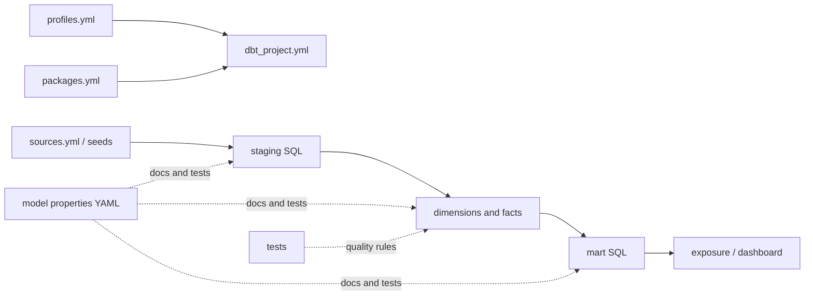

# Important dbt file templates

This guide answers two questions:

1. Which files matter in a dbt project?
2. What is the smallest useful template for each file?

The examples use this repository's Snowflake project. Replace names in angle
brackets such as `<model_name>`; do not copy the angle brackets themselves.

## The short list

Learn these files first, in this order:

| Priority | File | Why it exists | Example here |
|---|---|---|---|
| 1 | `README.md` | Tells a teammate how to install, build, test, and troubleshoot the project. | `README.md` |
| 2 | `dbt_project.yml` | Defines the project name, folders, defaults, hooks, and materializations. | `dbt_project.yml` |
| 3 | `profiles.yml` | Describes how dbt connects to a warehouse. Keep credentials out of Git. | `_prod_profiles/profiles.yml` |
| 4 | `packages.yml` | Pins reusable dbt packages. | `packages.yml` |
| 5 | `models/sources.yml` | Names raw warehouse objects and tests their freshness and shape. | `models/sources.yml` |
| 6 | `models/.../*.sql` | Contains one transformation query per model. | `models/src`, `models/dim`, `models/fct`, `models/mart` |
| 7 | A model properties `.yml` file | Documents models and columns and attaches tests and contracts. | `models/schema.yml` |
| 8 | `seeds/*.csv` | Stores small, version-controlled learning or reference datasets. | `seeds/seed_full_moon_dates.csv` |
| 9 | `snapshots/*.yml` | Preserves the history of mutable source rows. | `snapshots/raw_hosts_snapshot.yml` |
| 10 | `tests/*.sql` and generic test macros | Encodes business rules as queries that return bad rows. | `tests/` |

Macros, analyses, exposures, selectors, and Node scripts become important after
the core source-to-mart path works.

## How the files fit together



`source()` connects a staging model to raw data. `ref()` connects one dbt
resource to another and gives dbt enough information to build the DAG in the
right order. Prefer those functions over hard-coded database and schema names.

## 1. Repository README

A useful README is an operating manual, not a project slogan. At minimum it
should include:

```markdown
# <project name>

One sentence describing the business problem.

## Architecture

raw -> staging -> dimensions/facts -> marts -> dashboard

## Quick start

1. Install dependencies.
2. Configure the warehouse connection.
3. Run `dbt deps`.
4. Run `dbt build`.

## Common commands

- `dbt build --select <model>+`
- `dbt test --select <model>`
- `dbt docs generate`

## Security

Never commit `.env`, `profiles.yml`, passwords, private keys, or production data.
```

## 2. `dbt_project.yml`

This file controls project-wide behavior. Use folder defaults to keep individual
models small, then override them only when there is a reason.

```yaml
name: '<project_name>'
version: '1.0.0'
profile: '<profile_name>'

model-paths: ['models']
seed-paths: ['seeds']
test-paths: ['tests']
snapshot-paths: ['snapshots']
macro-paths: ['macros']

clean-targets:
  - target
  - dbt_packages

models:
  <project_name>:
    +materialized: view
    staging:
      +materialized: ephemeral
    dimensions:
      +materialized: table
    facts:
      +materialized: incremental
```

Important lesson: a folder name does not make a model a table, view, or fact.
The effective dbt configuration does that.

## 3. `profiles.yml`

The profile belongs in `~/.dbt/profiles.yml` or another private profile
directory. Commit only a sanitized example that reads secrets from environment
variables.

```yaml
<profile_name>:
  target: dev
  outputs:
    dev:
      type: snowflake
      account: "{{ env_var('SNOWFLAKE_ACCOUNT') }}"
      user: "{{ env_var('DBT_USER') }}"
      private_key: "{{ env_var('PRIVATE_KEY') }}"
      private_key_passphrase: "{{ env_var('PRIVATE_KEY_PASSPHRASE') }}"
      role: TRANSFORM
      database: <DATABASE>
      warehouse: <WAREHOUSE>
      schema: "DBT_{{ env_var('DBT_ENV_NAME') | upper }}"
      threads: 4
```

Run `dbt debug` before troubleshooting model SQL. It separates connection
problems from transformation problems.

## 4. `packages.yml`

Pin package versions so teammates and CI resolve the same macros.

```yaml
packages:
  - package: dbt-labs/dbt_utils
    version: 1.3.3
```

After changing this file, run `dbt deps`. Commit `packages.yml`; do not commit
the generated `dbt_packages/` directory.

## 5. Source properties

Sources describe warehouse objects that dbt does not build.

```yaml
version: 2

sources:
  - name: <source_name>
    database: <raw_database>
    schema: <raw_schema>
    tables:
      - name: <logical_table_name>
        identifier: <physical_table_name>
        config:
          loaded_at_field: loaded_at
          freshness:
            warn_after: {count: 24, period: hour}
        columns:
          - name: id
            data_tests:
              - not_null
              - unique
```

Use it in SQL with `{{ source('<source_name>', '<logical_table_name>') }}`.

## 6. Staging model

One staging model normally reads one source and does light cleanup: rename,
cast, normalize, and remove unusable rows. Avoid business aggregations here.

```sql
with source as (
    select *
    from {{ source('<source_name>', '<table_name>') }}
),

renamed as (
    select
        id as <entity>_id,
        trim(name) as <entity>_name,
        created_at::timestamp_ntz as created_at
    from source
)

select * from renamed
```

This project uses `src_*` as its staging prefix and configures that folder as
ephemeral. Many teams use `stg_*` and views instead; consistency matters more
than the exact prefix.

## 7. Dimension model

A dimension describes a business entity at one declared grain.

```sql
{{ config(materialized='table') }}

with staged as (
    select * from {{ ref('src_<entity>') }}
)

select
    <entity>_id,
    <descriptive_column>,
    created_at,
    updated_at
from staged
```

The primary key must be unique at the dimension's grain. If the business wants
history, use a snapshot or a deliberate slowly changing dimension design rather
than silently duplicating keys.

## 8. Fact model

A fact records an event or measurement. Put the grain at the top of the file in
a comment and test its key.

```sql
{{
  config(
    materialized='incremental',
    unique_key='<event_id>',
    incremental_strategy='merge',
    on_schema_change='fail'
  )
}}

-- Grain: one row per <event_id>.
with staged as (
    select * from {{ ref('src_<events>') }}
)

select
    <event_id>,
    <dimension_id>,
    event_at,
    amount
from staged


where updated_at >= dateadd(
    day,
    -3,
    (select coalesce(max(updated_at), '1900-01-01') from {{ this }})
)

```

The lookback handles recently corrected records. The `unique_key` lets a merge
update an existing event instead of inserting a duplicate. Always test a full
refresh and a second incremental run.

## 9. Mart model

A mart answers a defined reporting question and has its own grain.

```sql
-- Grain: one row per event_date and category.
with facts as (
    select * from {{ ref('fct_<events>') }}
)

select
    cast(event_at as date) as event_date,
    category,
    count(*) as event_count,
    sum(amount) as total_amount
from facts
group by 1, 2
```

Never add monetary values across currencies. Include `currency_code` in the
grain or convert amounts using a governed exchange-rate model.

## 10. Model properties and tests

Place descriptions and tests beside the models they govern.

```yaml
version: 2

models:
  - name: fct_<events>
    description: One row per business event.
    columns:
      - name: <event_id>
        description: Stable identifier for the event.
        data_tests:
          - not_null
          - unique

      - name: <dimension_id>
        data_tests:
          - not_null
          - relationships:
              arguments:
                to: ref('dim_<entity>')
                field: <dimension_id>

      - name: status
        data_tests:
          - accepted_values:
              arguments:
                values: ['pending', 'completed', 'failed']
```

Generic tests are reusable. Singular tests are ordinary SQL files in `tests/`.
Both must return zero rows to pass.

## 11. Seed and seed properties

Use seeds for small static datasets, mappings, or safe synthetic examples—not
large facts or secrets.

```csv
status_code,status_name
1,pending
2,completed
3,failed
```

```yaml
version: 2

seeds:
  - name: seed_status_codes
    columns:
      - name: status_code
        data_tests: [not_null, unique]
```

Load and inspect them with `dbt seed --show`.

## 12. Snapshot

Use a snapshot when a mutable source does not preserve its own history.

```yaml
version: 2

snapshots:
  - name: scd_<source_table>
    relation: source('<source_name>', '<table_name>')
    config:
      unique_key: id
      strategy: timestamp
      updated_at: updated_at
      hard_deletes: invalidate
```

Snapshots add dbt validity columns. Downstream models decide whether they need
the current version or the full history.

## 13. Singular and generic tests

Singular business rule:

```sql
-- tests/completed_events_have_amount.sql
select *
from {{ ref('fct_<events>') }}
where status = 'completed' and amount <= 0
```

Reusable generic test:

```sql

select *
from {{ model }}
where {{ column_name }} < 0

```

A test query returns failures, not successes. That inversion is one of the most
important dbt concepts to remember.

## 14. Macro

Create a macro when logic truly repeats or needs warehouse-aware behavior.

```sql

    round({{ column_name }} / 100.0, {{ scale }})

```

Do not turn every SQL expression into a macro. Plain SQL is easier to read and
debug until reuse is real.

## 15. Analysis, exposure, and selector

- An analysis is a version-controlled query that dbt compiles but does not
  materialize. Use it for investigation or handoff SQL.
- An exposure records a dashboard, notebook, or application that depends on dbt
  resources. It shows downstream impact in lineage.
- A selector gives a reusable name to a set of DAG nodes for development or CI.

Examples in this project are `analyses/full_moon_no_sleep.sql`,
`models/dashboards.yml`, and `selectors.yml`.

## 16. Node files

For a small Node learning tool, keep the contract obvious:

```json
{
  "scripts": {
    "learn": "node scripts/query-local.mjs",
    "query:snowflake": "node --env-file-if-exists=.env scripts/query-snowflake.mjs"
  }
}
```

- `package.json` declares supported commands and dependencies.
- `package-lock.json` locks exact dependency versions and should be committed.
- `.env.example` documents variable names with fake values and should be
  committed.
- `.env` contains real values and must be ignored.
- `node_modules/` is generated and must be ignored.

## Pre-commit checklist

- Every model has a stated grain.
- Every primary key has `not_null` and `unique` tests.
- Every important foreign key has a relationship test.
- Money is not aggregated across currencies.
- Models use `ref()` or `source()` rather than environment-specific names.
- `dbt build` succeeds from a clean checkout.
- No password, private key, payment credential, customer PII, or `.env` file is
  staged in Git.
- The README commands match the commands that were actually tested.
