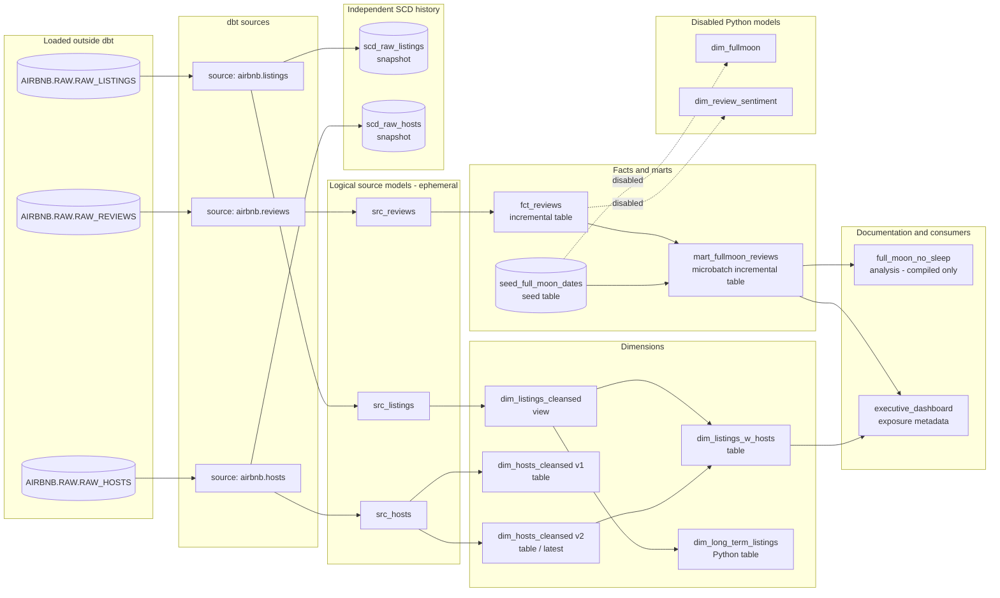

# Airbnb dbt Pipeline Walkthrough

This guide explains what the existing Airbnb project does, in the order data moves through it. It is written for a junior analytics engineer who wants to connect each file to the Snowflake object or dbt behavior it creates.

> Important boundary: this repository is primarily an **ELT transformation project**. dbt does not download the Airbnb CSV files or create the three raw source tables. The raw data must already exist in Snowflake before dbt runs.

## 1. The pipeline at a glance

The three raw Airbnb tables are loaded outside dbt. dbt then declares them as sources, compiles the `src` models into downstream SQL, cleans and joins the data, and publishes fact, dimension, and mart relations. A seed supplies full-moon dates. Snapshots preserve source history, but no downstream model currently reads those snapshots.



The graph contains parallel branches. With four dbt threads, independent nodes can run at the same time; there is not one guaranteed line-by-line execution order. dbt guarantees dependency order.

## 2. Project configuration and connection

The project entry point is [`dbt_project.yml`](../dbt_project.yml).

It defines these resource locations:

| Resource | Directory | Purpose |
|---|---|---|
| Models | `models/` | SQL and Python transformations |
| Analyses | `analyses/` | SQL that is compiled but not materialized |
| Data tests | `tests/` | Singular and generic tests |
| Seeds | `seeds/` | Version-controlled CSV data loaded by dbt |
| Macros | `macros/` | Reusable Jinja and project behavior |
| Snapshots | `snapshots/` | Slowly changing dimension history |
| Documentation assets | `assets/` | Static files used by dbt Docs |

The project name and profile name are both `airbnb`. The checked-in profile is [`_prod_profiles/profiles.yml`](../_prod_profiles/profiles.yml), so commands in this guide pass `--profiles-dir _prod_profiles` explicitly.

Runtime prerequisites come from the repository's `pyproject.toml` and `requirements.txt`:

- Python 3.10 through 3.13 (`>=3.10,<3.14`)
- `uv` to create and run the locked project environment
- dbt Core and the Snowflake adapter in the 1.11 release line, installed by
  `uv sync`; `uv.lock` records the exact reproducible versions
- access to a Snowflake account with the database, warehouse, source tables, roles, and key-pair credentials described below

The currently installed Node.js runtime is v24.18.0 with npm 11.16.0. It is useful for a separate learning query client after dbt publishes the relations; the dbt project itself still runs through Python and `uv`.

### Required environment variables

The Snowflake profile reads all credentials from environment variables:

- `SNOWFLAKE_ACCOUNT`
- `DBT_USER`
- `PRIVATE_KEY`
- `PRIVATE_KEY_PASSPHRASE`
- `DBT_ENV_NAME` for the development schema suffix

Do not commit those values. The profile connects to database `AIRBNB`, warehouse `COMPUTE_WH`, and role `TRANSFORM` with four threads.

### Targets and output schemas

The custom [`generate_schema_name`](../macros/generate_schema_name.sql) macro changes the normal dbt custom-schema behavior.

| Target | Base `target.schema` | Normal models, seeds, snapshots | `mart_fullmoon_reviews` | Stored data-test failures |
|---|---|---|---|---|
| `dev` | `DBT_<DBT_ENV_NAME>` | `AIRBNB.DBT_<DBT_ENV_NAME>` | `AIRBNB.DBT_<DBT_ENV_NAME>_MART` | `AIRBNB.DBT_<DBT_ENV_NAME>__TEST_FAILURES` |
| `staging` | `STAGING` | `AIRBNB.STAGING` | `AIRBNB.STAGING_MART` | `AIRBNB.STAGING__TEST_FAILURES` |
| `prod` | `PROD` | `AIRBNB.PROD` | `AIRBNB.MART` | `AIRBNB._TEST_FAILURES` |

The double underscore in the non-production test-failure schemas is expected: dbt joins the target schema, an underscore, and the configured custom schema `_test_failures`.

## 3. Step 0: provision Snowflake and load raw data

The upstream loading SQL is documented in [`../../_course_resources/course-resources.md`](../../_course_resources/course-resources.md). It creates:

- `AIRBNB.RAW.RAW_LISTINGS`
- `AIRBNB.RAW.RAW_HOSTS`
- `AIRBNB.RAW.RAW_REVIEWS`

It then uses Snowflake `COPY INTO` to load course CSV files from S3. This work is not represented as a dbt model and cannot be performed by `dbt build`.

The setup also creates the `TRANSFORM` and `REPORTER` roles expected by this project. A successful build requires `TRANSFORM` to be able to use the warehouse, read `AIRBNB.RAW`, create schemas and relations, run Snowflake Python models, and grant `SELECT` to the configured roles.

Raw table relationships are:

- `RAW_LISTINGS.ID` is the listing key.
- `RAW_LISTINGS.HOST_ID` points to `RAW_HOSTS.ID`.
- `RAW_REVIEWS.LISTING_ID` points to `RAW_LISTINGS.ID`.

## 4. Step 1: declare and validate sources

[`models/sources.yml`](../models/sources.yml) maps friendly dbt source names to the raw Snowflake tables:

| dbt reference | Snowflake relation |
|---|---|
| `source('airbnb', 'listings')` | `AIRBNB.RAW.RAW_LISTINGS` |
| `source('airbnb', 'hosts')` | `AIRBNB.RAW.RAW_HOSTS` |
| `source('airbnb', 'reviews')` | `AIRBNB.RAW.RAW_REVIEWS` |

Source declarations do not copy or transform data. They give dbt a named lineage boundary and a place for source tests and freshness rules.

Current source checks are:

- Listings must have exactly four distinct `room_type` values.
- Listing `price` strings must match the configured currency regular expression.
- Review freshness uses `date` as `loaded_at_field` and warns when the newest record is more than one hour old.

Freshness is a separate command; `dbt build` does not run it:

```powershell
uv run dbt source freshness --profiles-dir _prod_profiles --target dev
```

The course review data is static and historical, so the one-hour rule will normally warn unless the raw table is actively refreshed. There is no active freshness `error_after` threshold.

## 5. Step 2: load the seed

[`seeds/seed_full_moon_dates.csv`](../seeds/seed_full_moon_dates.csv) contains 272 unique full-moon dates from `2009-01-11` through `2030-12-09`.

`dbt seed` loads it as `SEED_FULL_MOON_DATES` in the target's base schema. The seed is later joined to reviews by `mart_fullmoon_reviews`.

```powershell
uv run dbt seed --profiles-dir _prod_profiles --target dev
```

A full `dbt build` also includes selected seeds, so running the standalone seed command is mainly useful while learning or refreshing seed data independently.

## 6. Step 3: standardize raw columns in the ephemeral `src` layer

All files under `models/src/` inherit `+materialized: ephemeral` from `dbt_project.yml`.

An ephemeral model is not a Snowflake view or table. dbt compiles its query into a CTE inside each downstream model. Therefore, it is correct that no `SRC_LISTINGS`, `SRC_HOSTS`, or `SRC_REVIEWS` relation appears after a build.

### `src_listings`

[`models/src/src_listings.sql`](../models/src/src_listings.sql) reads the listings source and renames:

- `id` to `listing_id`
- `name` to `listing_name`
- `price` to `price_str`

It retains the URL, room type, minimum nights, host key, and timestamps.

### `src_hosts`

[`models/src/src_hosts.sql`](../models/src/src_hosts.sql) renames:

- `id` to `host_id`
- `name` to `host_name`

It retains `is_superhost`, `created_at`, and `updated_at`.

### `src_reviews`

[`models/src/src_reviews.sql`](../models/src/src_reviews.sql) renames:

- `date` to `review_date`
- `comments` to `review_text`
- `sentiment` to `review_sentiment`

## 7. Step 4: build dimensions

The `models/dim/` directory defaults to table materialization, but a model-level `config()` can override it.

### `dim_listings_cleansed`

[`models/dim/dim_listings_cleansed.sql`](../models/dim/dim_listings_cleansed.sql) is explicitly a **view**, despite the dimension-folder table default.

It:

1. Reads the compiled `src_listings` CTE.
2. Replaces `minimum_nights = 0` with `1`.
3. Removes the dollar sign from `price_str` and casts the result to `NUMBER(10,2)`.
4. Publishes listing attributes, the host key, and source timestamps.

Its `event_time` is `created_at`, which lets dbt's sampling/event-time features reason about this model.

### Versioned host dimensions

[`models/schema.yml`](../models/schema.yml) declares `dim_hosts_cleansed` as a versioned, contracted model whose latest version is v2.

- [`models/dim/dim_hosts_cleansed.sql`](../models/dim/dim_hosts_cleansed.sql) defines v1 and replaces a null host name with `Anonymous`.
- [`models/dim/dim_hosts_cleansed_v2.sql`](../models/dim/dim_hosts_cleansed_v2.sql) defines v2 and replaces a null host name with `N/A`.

Both are tables. Their default Snowflake identifiers are `DIM_HOSTS_CLEANSED_V1` and `DIM_HOSTS_CLEANSED_V2`. An unversioned `ref('dim_hosts_cleansed')` resolves to latest version v2; `dim_listings_w_hosts` pins v2 explicitly.

The enforced contract requires the declared column names and data types. `host_id` and `host_name` also have `not_null` constraints. Constraints are part of relation creation; they are different from dbt data tests.

### `dim_listings_w_hosts`

[`models/dim/dim_listings_w_hosts.sql`](../models/dim/dim_listings_w_hosts.sql) is a table that left joins every cleansed listing to host v2 on `host_id`.

It adds:

- `host_name`
- `host_is_superhost`
- a combined `updated_at` equal to the greatest listing or host update timestamp

Because this is a left join, a listing remains present even when its host is missing. Host fields will be null for an unmatched key.

### `dim_long_term_listings`

[`models/dim/dim_long_term_listings.py`](../models/dim/dim_long_term_listings.py) is the one enabled Python model. It uses Snowpark to filter `dim_listings_cleansed` to listings with at least 30 minimum nights and returns `LISTING_ID`, `LISTING_NAME`, and `PRICE` as a table.

This model runs in Snowflake, not in local Node.js or local Python. The Snowflake role must have the privileges needed for dbt Python model execution.

## 8. Step 5: build the review fact

[`models/fct/fct_reviews.sql`](../models/fct/fct_reviews.sql) is an incremental table tagged `fact`.

It:

1. Reads the compiled `src_reviews` CTE.
2. Removes reviews whose text is null.
3. Creates `review_id` with `dbt_utils.generate_surrogate_key` from listing, review date, reviewer name, and review text.
4. Loads all qualifying rows on the first run.
5. Applies an incremental date filter on later runs.

If both variables are passed, the interval is start-inclusive and end-exclusive:

```powershell
uv run dbt run --select fct_reviews --profiles-dir _prod_profiles --target dev --vars '{start_date: "2024-02-15 00:00:00", end_date: "2024-03-15 00:00:00"}'
```

Without variables, dbt loads rows where `review_date` is greater than the table's current maximum date.

Current incremental limitations to understand:

- There is no incremental `unique_key`, so rerunning overlapping variable windows can append duplicates.
- The maximum-date approach misses late-arriving records whose date equals or predates the current maximum.
- If an existing incremental table is empty, `MAX(review_date)` is null and the fallback predicate will not select rows. A full refresh of this fact repairs that state.
- `on_schema_change='fail'` intentionally stops the run when upstream columns change.

## 9. Step 6: build the full-moon mart

[`models/mart/mart_fullmoon_reviews.sql`](../models/mart/mart_fullmoon_reviews.sql) joins `fct_reviews` to the full-moon seed.

Its definition treats a review as `full moon` when the review date is **one day after** a listed full-moon date:

```sql
TO_DATE(review_date) = DATEADD(DAY, 1, full_moon_date)
```

All other reviews are labeled `not full moon`.

This model is:

- an incremental model using dbt's `microbatch` strategy;
- partitioned logically by `review_date` event time;
- configured with a `2009-06-20` beginning and one-year batches;
- tagged `fact`;
- written to the custom `mart` schema described earlier.

The model sets `full_refresh=false`. That protects it from ordinary project-wide `--full-refresh` commands. Do not assume `dbt run --full-refresh` will rebuild this mart; change the protection deliberately only when a true rebuild is intended.

## 10. Step 7: capture source history with snapshots

Snapshots are independent history tables in this project:

- [`snapshots/raw_listings_snapshot.yml`](../snapshots/raw_listings_snapshot.yml) creates `SCD_RAW_LISTINGS` from the listings source.
- [`snapshots/raw_hosts_snapshot.yml`](../snapshots/raw_hosts_snapshot.yml) creates `SCD_RAW_HOSTS` from the hosts source.

Both use the timestamp strategy:

- source `id` is the `unique_key`;
- source `updated_at` detects a changed version;
- `hard_deletes: invalidate` closes the current snapshot record when a source row disappears.

Run them independently with:

```powershell
uv run dbt snapshot --profiles-dir _prod_profiles --target dev
```

`dbt build` includes selected snapshots. No current dimension, fact, or mart reads a snapshot, so snapshots preserve history for learning/auditing but do not affect the published analytics outputs.

## 11. Tests and quality gates

The project globally sets `store_failures: true`, so dbt persists the rows returned by data tests in the target-specific test-failure schema.

### Singular tests

| File | Failure condition |
|---|---|
| [`tests/consistent_created_at.sql`](../tests/consistent_created_at.sql) | A listing was created after one of its reviews. |
| [`tests/dim_listings_minimum_nights.sql`](../tests/dim_listings_minimum_nights.sql) | A cleansed listing still has fewer than one minimum night. |

### Custom generic tests

| File | Behavior |
|---|---|
| [`tests/generic/minimum_row_count.sql`](../tests/generic/minimum_row_count.sql) | Fails when a model has fewer than the requested rows. Its default severity is warning, but the use on `dim_listings_cleansed` overrides severity to error. |
| [`tests/generic/positive_values.sql`](../tests/generic/positive_values.sql) | Returns values less than or equal to zero. |

### Model and column tests

[`models/schema.yml`](../models/schema.yml) applies these main assertions:

- `dim_listings_cleansed` has at least 1,000 rows.
- Listing keys are unique and non-null.
- Listing host keys are non-null and exist in the latest host dimension.
- Room type is one of the four accepted values.
- Minimum nights are positive.
- Host keys are unique, and superhost values are `t` or `f`.
- `dim_listings_w_hosts` has the same row count as the raw listings source.
- Listing price is numeric and stays within configured distribution/range expectations; the maximum-price check is warning severity.
- Review listing keys exist in `dim_listings_cleansed`.
- Reviewer names are non-null and review sentiment is positive, neutral, or negative.

The project uses `dbt_expectations` for source and statistical tests and dbt's built-in tests for uniqueness, nulls, relationships, and accepted values.

### Unit test

[`models/mart/unit_tests.yml`](../models/mart/unit_tests.yml) supplies three fake reviews and one fake full-moon date to `mart_fullmoon_reviews`. It proves that January 15 is labeled full moon when the seed contains January 14, while January 13 and January 14 are not.

During `dbt build`, a model's unit tests run before dbt materializes that model. Data tests run after their required relations exist; a failing upstream test can prevent downstream nodes from building.

## 12. Hooks, grants, and audit logging

`dbt_project.yml` defines one start hook and one model post-hook.

### Start hook

At the beginning of an executing dbt run/build, dbt creates this table when needed:

```text
<target database>.<target base schema>.AUDIT_LOG
```

It contains `model_name` and `run_timestamp`.

### Model post-hook

After each successfully materialized model, dbt inserts that relation's name and the current timestamp into the base-schema audit log. Even the custom-schema mart writes its audit entry to the base target schema.

The hook is configured under `models:`, so it does not create an entry for seeds, snapshots, analyses, exposures, or data tests. Ephemeral models are not materialized and therefore do not receive a post-hook entry.

### Grants

Every materialized model receives `SELECT` grants for roles `TRANSFORM` and `REPORTER`. These model grants do not automatically cover seeds, snapshots, the audit table, or stored test-failure relations.

## 13. Packages and reusable macros

[`packages.yml`](../packages.yml) pins:

- `dbt-labs/dbt_utils` 1.3.3
- `metaplane/dbt_expectations` 0.10.10

Run `dbt deps` after cloning. The reproducibility lock `package-lock.yml` is
committed; the generated `dbt_packages/` directory is not.

Project macros are:

| Macro | File | How it is used |
|---|---|---|
| `generate_schema_name` | [`macros/generate_schema_name.sql`](../macros/generate_schema_name.sql) | Automatically controls custom schema names. |
| `drop_dev_schemas` | [`macros/drop_dev_schemas.sql`](../macros/drop_dev_schemas.sql) | Operation that drops schemas beginning with the current `DBT_...` prefix. |
| `learn_logging` | [`macros/logging.sql`](../macros/logging.sql) | Teaching operation for Jinja logging. |
| `learn_variables` | [`macros/variables.sql`](../macros/variables.sql) | Teaching operation for project/CLI variables. |
| `logging_and_variables` | [`macros/variable_test.sql`](../macros/variable_test.sql) | Additional variable/logging exercise. |
| `select_positive_values` | [`macros/select_positive_values.sql`](../macros/select_positive_values.sql) | Reusable SQL-returning example; no production model currently calls it. |
| `no_empty_strings` | [`macros/no_empty_strings.sql`](../macros/no_empty_strings.sql) | Builds predicates for string columns; no production model currently calls it. |

Examples:

```powershell
uv run dbt run-operation learn_logging --profiles-dir _prod_profiles --target dev
uv run dbt run-operation learn_variables --profiles-dir _prod_profiles --target dev --vars '{user_name: Key1Lee}'
```

The cleanup macro refuses targets whose schema does not start with `DBT_` or
contains characters other than letters, digits, and underscores. It drops the
exact target schema plus custom schemas separated by an underscore, and quotes
every returned identifier. Verify `DBT_ENV_NAME` carefully because this remains
an intentionally destructive development-only operation.

```powershell
uv run dbt run-operation drop_dev_schemas --profiles-dir _prod_profiles --target dev
```

## 14. Analysis, exposure, and documentation

[`analyses/full_moon_no_sleep.sql`](../analyses/full_moon_no_sleep.sql) groups full-moon mart rows by `is_full_moon` and `review_sentiment` and counts reviews.

An analysis is compiled SQL, not a Snowflake relation. `dbt build` will not create `FULL_MOON_NO_SLEEP`. Compile it and inspect the generated SQL under `target/compiled/`:

```powershell
uv run dbt compile --select full_moon_no_sleep --profiles-dir _prod_profiles --target dev
```

[`models/dashboards.yml`](../models/dashboards.yml) declares the `executive_dashboard` exposure. It documents a Preset/Superset dashboard that depends on `dim_listings_w_hosts` and `mart_fullmoon_reviews`. An exposure enriches lineage and ownership metadata; it does not build or refresh the external dashboard.

Project documentation also includes:

- [`models/docs.md`](../models/docs.md), a reusable description for minimum nights;
- [`models/overview.md`](../models/overview.md), the dbt Docs project overview;
- [`models/test_docs.yml`](../models/test_docs.yml), documentation for the custom minimum-row-count test;
- [`assets/input_schema.png`](../assets/input_schema.png), the source diagram used by dbt Docs.

Generate and serve the documentation locally with:

```powershell
uv run dbt docs generate --profiles-dir _prod_profiles --target dev
uv run dbt docs serve --profiles-dir _prod_profiles --target dev
```

## 15. Disabled Python models

Two Python files are intentionally disabled inside their `dbt.config()` calls and will not appear as built relations:

- [`models/dim/dim_fullmoon.py`](../models/dim/dim_fullmoon.py) would use the `holidays` package to mark seed dates that are German holidays.
- [`models/dim/dim_review_sentiment.py`](../models/dim/dim_review_sentiment.py) would use `textblob` to calculate a sentiment score from review text.

Enabling them is not just a selector change. Confirm Snowflake Python/package availability, expected output columns, model tests, warehouse cost, and role privileges first.

## 16. Recommended command sequence

From the repository root, install the pinned Python environment:

```powershell
uv sync
```

On this workstation, Node.js is installed, but `dbt` is not currently a global command. Use the repository environment through `uv run dbt`. Node.js can query the Snowflake relations after dbt builds them, but Node.js does not replace dbt's compilation or materialization work.

After setting the five environment variables, run:

```powershell
Set-Location .\airbnb

uv run dbt debug --profiles-dir _prod_profiles --target dev
uv run dbt deps --profiles-dir _prod_profiles --target dev
uv run dbt source freshness --profiles-dir _prod_profiles --target dev
uv run dbt build --profiles-dir _prod_profiles --target dev
uv run dbt docs generate --profiles-dir _prod_profiles --target dev
```

`dbt build` is the safest normal command because it combines seeds, snapshots, unit tests, models, and data tests in dependency order. Compare the narrower commands:

| Command | What it does |
|---|---|
| `dbt run` | Builds models only. It does not seed, snapshot, or run data tests. |
| `dbt test` | Runs unit/data tests selected for the command; it does not build missing parents. |
| `dbt seed` | Loads CSV seeds. |
| `dbt snapshot` | Updates snapshot history tables. |
| `dbt source freshness` | Evaluates source freshness separately. |
| `dbt compile` | Renders SQL/Jinja without materializing models. |
| `dbt build` | Runs selected seeds, snapshots, tests, and models in DAG order. |

Useful learning selections include:

```powershell
# Build one model and its upstream dependencies.
uv run dbt build --select +dim_listings_w_hosts --profiles-dir _prod_profiles --target dev

# Build fact-tagged resources and their upstream dependencies.
uv run dbt build --select +tag:fact --profiles-dir _prod_profiles --target dev

# dbt Core 1.11 selector syntax for the checked-in selector.
uv run dbt run --selector dim_except_listings_w_hosts --profiles-dir _prod_profiles --target dev
```

## 17. What `dbt build` does in this project

A development build behaves conceptually like this:

1. dbt reads the project, profile, packages, resource configs, and dependency graph.
2. The start hook ensures `AIRBNB.DBT_<DBT_ENV_NAME>.AUDIT_LOG` exists.
3. Source tests can validate raw data before dependent resources continue.
4. The full-moon seed and the two source snapshots can run independently of one another.
5. Unit-test fixtures validate the full-moon mart SQL before that model is materialized.
6. Ephemeral `src` SQL is compiled into its consumers rather than built as separate relations.
7. Listing and host dimensions and the review fact build after their source dependencies.
8. `dim_listings_w_hosts` waits for cleansed listings and host v2; `dim_long_term_listings` waits for cleansed listings.
9. `mart_fullmoon_reviews` waits for the review fact and full-moon seed.
10. Data tests run when their parent resources are ready and store their result relations in the failure schema.
11. Each successfully materialized model writes one audit entry through its post-hook.

Steps without dependency edges may interleave because the profile allows four threads.

## 18. Current caveats and inconsistencies

These are important when interpreting the repository:

1. **Raw ingestion is external.** A green dbt project cannot compensate for missing `AIRBNB.RAW` tables.
2. **Static review data will normally fail the spirit of a one-hour freshness rule.** It is warning-only in the checked-in source config.
3. **The `src` layer is logical, not physical.** Query downstream dimensions/facts, or inspect compiled CTEs, instead of looking for `SRC_*` tables.
4. **Snapshots are not consumed downstream.** They demonstrate SCD history but do not currently make dimensions historically accurate.
5. **The review fact is append-oriented without a unique key.** Late and replayed data require deliberate handling.
6. **The full-moon definition means the day after the astronomical date.** This is intentional and is proven by the unit test.
7. **The mart opts out of full refresh.** A general `--full-refresh` does not guarantee that the mart is rebuilt.
8. **The input schema image contains teaching-diagram mistakes.** It labels `listing_url` and host `name` as integers, and labels the raw host flag `host_is_superhost`; the actual raw DDL/model code uses strings and the raw column name `is_superhost`.
9. **The Dagster schedule does not cover the partitioned review fact.**
   [`../../dbt_dagster_project/dbt_dagster_project/constants.py`](../../dbt_dagster_project/dbt_dagster_project/constants.py)
   resolves this `airbnb` project correctly, but the daily non-partitioned asset
   selection excludes `fct_reviews`; the separate partitioned `fct_reviews`
   asset has no schedule in the checked-in file.
10. **The checked-in CI is intentionally offline.**
    `learning-lab-ci.yml` runs the Node lab and parses the dbt project with
    placeholder connection values, but it does not connect to Snowflake. A real
    warehouse build remains a manual, credentialed check.
11. **Analyses and exposures are metadata/compiled SQL.** They are not queryable Snowflake tables created by `dbt build`.

## 19. Published relations to query after a dev build

With `DBT_ENV_NAME=LEARNING`, the main queryable relations are expected to be:

```text
AIRBNB.DBT_LEARNING.DIM_LISTINGS_CLEANSED
AIRBNB.DBT_LEARNING.DIM_HOSTS_CLEANSED_V1
AIRBNB.DBT_LEARNING.DIM_HOSTS_CLEANSED_V2
AIRBNB.DBT_LEARNING.DIM_LISTINGS_W_HOSTS
AIRBNB.DBT_LEARNING.DIM_LONG_TERM_LISTINGS
AIRBNB.DBT_LEARNING.FCT_REVIEWS
AIRBNB.DBT_LEARNING.SEED_FULL_MOON_DATES
AIRBNB.DBT_LEARNING.SCD_RAW_LISTINGS
AIRBNB.DBT_LEARNING.SCD_RAW_HOSTS
AIRBNB.DBT_LEARNING_MART.MART_FULLMOON_REVIEWS
AIRBNB.DBT_LEARNING.AUDIT_LOG
```

`DIM_LISTINGS_CLEANSED` is a view. The other listed analytics outputs are tables or incremental tables. `SRC_*`, `FULL_MOON_NO_SLEEP`, `DIM_FULLMOON`, and `DIM_REVIEW_SENTIMENT` should not exist as queryable relations for the reasons explained above.
